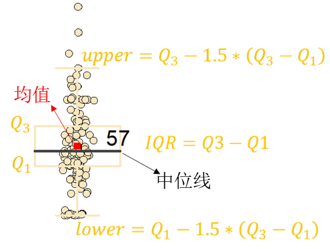

# 数据

## 1.数据采集
数据来源：
- **Classification of Rockburst in Underground Projects Comparison of Ten Supervised Learning Methods** _(246)_
- **Prediction of rock burst in underground caverns based on roughset and extensible comprehensive evaluation** _(20)_
- **北山花岗岩岩爆特征实验研究及现场综合监测分析** _(46)_
- **工程岩爆灾害判别的RBF-AR耦合模型** _(26)_
- **基于CRITIC-XGB算法的岩爆倾向等级预测模型** _(50)_
- **深部金属矿山RS-TOPSIS岩爆预测模型及其应用** _(20)_
- **Prediction of rockburst classification using Random Forest-Longjun** _(46)_

从以上学术论文中获取**岩爆数据样本**（_括号中的数字为文章中的数据条数_）：

- 调用 **_MinerU API_** 将文章 pdf 文件解析为 json -> **MinerU_.json**
- 提取表格 json，并修复可能的单元格内换行导致的数值断裂问题 -> **table_.json**
- 调用***智谱大模型***，基于 _**prompt.txt**_（_角色、任务、规则、输出、示例_）得到目标表格数据 json，并进一步结构化 -> **ZHIPU_.json**

## 2.数据清洗
岩体参数列物理含义如下，另外，大部分论文（_经验_）表明 ***Wet*** 、***σθ*** 与岩爆发生相关性强，：
- _**σθ**_：最大应切力；
- _**σc**_：单轴抗压强度，在单向压缩条件下，岩块能承受的最大压应力；
- _**σt**_：单轴抗拉强度，在单向拉伸条件下，岩块能承受的最大拉应力；
- _**Wet**_：弹性性能指数，表征岩石的冲击倾向性，值越大说明岩体存储了大量能量且不容易通过塑性变形释放掉，一旦破坏，能量会瞬间释放，发生岩爆可能性越高；
- _**Kv**_：岩石完整性整数，值越接近1，说明岩体越完整，能量积聚能力越强，发生剧烈岩爆的可能性越高； 值越小，说明岩体中裂隙越发育，能量积聚能力越弱且耗散能力越强，发生普通塌方或剥落的可能性高；
- _**σθ/σc**_：见 _SCF_；
- _**σc/σt**_：见 _B1_；
- _**SCF**_：应力集中系数***SCF=σθ/σc***，表征外荷载与岩体抗力的比值，_σθ/σc≫1_，说明应力远超强度，岩体必然破坏；
- _**B1**_：脆性系数***B1=σc/σt***，值越大，说明岩石越脆，内部缺陷越多或越容易失稳扩展；
- _**B2**_：脆性系数***B2=(σc-σt)/(σc+σt)***，对 _B1_ 的归一化，量化“耐压不耐拉”的极端程度，指数越高，塑性耗能越少，弹性能瞬间释放比例越大；
- ***D***或者***H***：深埋，不是直接的力学指标，但随深度增加，地应力升高，发生岩爆可能性也随之升高，是影响岩爆发生的环境因素；

数据清洗流程如下：
- ZHIPU_.json -> **.csv**
- 从数据文件中**提取目标列并合并**（_若提供的文件路径是一个文件夹，则表示对该文件夹下所有 csv 文件数据做清洗；若是一个 csv 文件，则只清洗该 csv 文件的数据_）
- 只提取输入列名中的列（_数据采集阶段已统一了岩体力学参数名和岩爆等级列名_），若原数据中不存在期望的列，则尝试计算，并删除始终无法计算出结果的行即**剔除含缺失值的行**
- **去重**

## 3.数据分析
经1、2步骤(_src/processor/dataget.py_)后得到 **merge.csv** 。
本次项目提取的参数列为***σθ***、_**σc**_、_**σt**_、_**SCF**_、_**B1**_、_**B2**_、_**Wet**_、_**MR**_，其中***MR***是岩爆等级标签，用连续的整型数字 **0、1、2、3 分别表示无、轻微、中等、强岩爆等级**。另外，在 7 个来源数据中， *北山花岗岩岩爆特征实验研究及现场综合监测分析* 的数据未被使用，因为它无法提供期望的所有列。（_可以通过更改 dataget.py 中的输入列获取期望的原始岩爆数据_）

这一部分是对训练集数据（_将原始岩爆数据按 8：2 划分为训练集和验证集_）进行数据分析，揭示各岩爆指标与岩爆等级之间的规律，以指导后续机器学习方法建模，使模型更具可解释性。使用 origin 进行数据分析，图表存放在 _static/plt_ 下。

### 分析原始的数据分布
- 用饼状图直观显示岩爆数据类别分布情况；
- 计算各统计参数（均值、方差、中位数、标准差、偏度、峰度、变异系数、最大值、最小值）；
- 用箱型图直观显示不同力学参数的数据分布，以下是箱型图示例，其中，*Q₁* 和 *Q₃* 分别是数据的第 25 个百分位数（_将数据由小到大排序后位于 25% 的位置，即大约有 25% 的数据值不大于该点_）和第 75 个百分位数，上、下须以外的数据点为异常值（_即大于 upper 或小于 lower 的数据点_），箱体中的黑色横线为数据的中位数，红色方块为均值。注意，均值不一定在箱体中，因其易受极端值影响；当数据存在较多异常值或偏态分布时，均值会发生偏移，偏移方向由极端值的分布位置决定。若均值显著偏离中位数且位于箱体上方（或下方），通常表明数据呈正偏态（或负偏态），此时中位数作为中心趋势度量比均值更稳健。中位数与均值的偏移大小可直观反映数据分布的偏斜程度及异常值对均值的影响强度，偏移越大，说明数据异常值的影响越显著；

  

- 独立性检验、相关性分析，**箱型图只是对数据的初步感知，还需结合非参数统计分析系统评估各参数的组间差异显著性与等级相关性**。这里选用 _Kruskal-Wallis_ 检验（用于判断各参数在不同岩爆等级下的分布**是否存在显著差异**，其零假设是假设各等级分布相同；选用该方法的原因是，岩爆等级的预测实际上是一个**分类问题**，且各参数**分布多呈非正态**，而该检验**不依赖正态性假设**，**对异常值稳健**）和 _Spearman_ 相关性分析（用于量化参数与岩爆等级的单调相关程度，选用该方法的原因是，**岩爆等级是定序变量，且各参数多呈非正态性**，而该方法基于秩次计算，**对非线性单调关系敏感**，且**不受离群点影响**；由于**数据多呈偏态**，_Spearman_ 比 _Pearson_ 更稳健）。

### 数据分析结果
- 饼状图直观地揭示了**岩爆数据集的类别分布情况**。数据显示，样本存在**轻微的不平衡现象**，其中，中等岩爆样本占比最高（_36%_），约为占比最低的无岩爆类别（_18.3%_）的两倍。这种量级差异处于**温和区间**，无需通过过采样技术强制平衡数据分布。但考虑到地下工程中**强岩爆发生所带来的巨大损失**，且样本中强岩爆事件占比（_18.5%_）不高，为防止模型因样本不足忽略高风险事件，在后续建模训练中应**赋予强岩爆类别更高的权重**。

  

- 不同岩爆烈度等级的各力学参数统计数据（均值、方差、中位数、标准差、偏度、峰度、变异系数、最大值、最小值、_IQR_）

  

- 箱型图揭示了各力学参数下不同岩爆等级数据的分布特征。
1. 中位线变化趋势与箱体重叠程度分析，初步感知各参数对岩爆等级的区分能力：随岩爆烈度由"无岩爆"向"强岩爆"递增，**_σθ_、_Wet_、_SCF_、_σc_ 与 _σt_ 的中位数均呈严格递增趋势**，_σθ_ 从 20.9 升至 105（_增幅400%_），_Wet_ 从 2.22 增至 6.815（_增幅207%_），_SCF_ 从 0.19 升至 0.7（_增幅268%_），_σc_ 从 106.31 增至 137.45*（增幅29%*），*σt* 从 5.2 增至 11.5（_增幅121%_）。然而，各参数的**箱体重叠程度存在差异**，**_σθ_ 的强岩爆组与其余等级、无岩爆组与中等岩爆组箱体基本无重叠，但轻微与中等岩爆组存在一定重叠；_Wet_ 的无岩爆与中等岩爆和强岩爆、轻微与强岩爆箱体无重叠，但相邻等级（无和轻微、轻微和中等、中等和强）间重叠近一半；_SCF_ 的无岩爆组与其他等级、中等与强岩爆组箱体分离清晰，但轻微与中等岩爆组重叠严重；_σc_ 与 _σt_ 在各等级间重叠均超过50%，单变量区分能力有限，需要进一步挖掘与岩爆烈度的联系**。_B1_ 呈递减趋势（_21.43→13.27_），反映强岩爆样本的 _σc_ 虽有所提升（_106.31→137.45_），但 _σt_ 增幅更为显著（_5.2→11.5_），导致脆性比值下降；_B2_ 基本稳定（_0.91→0.86_），且**箱体高度重叠，区分效能微弱**。
上述分布特征与岩爆物理机制相符合，**岩爆的发生源于高地应力作用下，完整岩体积聚大量弹性应变能，当应力集中系数逼近临界阈值时，能量无法通过塑性变形耗散而瞬时释放**。值得注意的是，_B1_ 的下降并非表明岩体脆性减弱，而是深部完整岩体中微裂隙闭合效应使 _σt_ 相对增强，这恰恰印证了"强岩强爆"现象，即**高强度、高完整性岩体在高应力环境下更易发生剧烈岩爆**。此外，_B1_ 与 _B2_ 虽均基于 _σc_ 与 _σt_ 构建，但 _B2_ 为归一化形式，物理含义侧重于"耐压不耐拉"的极端程度量化，二者在数值表现与工程解释上存在差异。
综合箱体重叠程度与物理机制，**_σθ_、_Wet_、_SCF_ 对岩爆等级具有较好的单变量区分能力**，可作为机器学习模型的核心输入特征；其中 **_σθ_ 对强岩爆识别效果突出，_Wet_ 与 _SCF_ 在无岩爆与中高烈度岩爆间区分明显，但三者对轻微与中等岩爆的区分均存在局限**，这提示后续建模需考虑多参数耦合或引入非线性特征变换。
2. 箱体高度变化与异常值情况分析：_σθ_、*Wet* 与 *SCF* 的箱体高度（_IQR_）不是单调变化趋势，其中 _σθ_ 的中等岩爆组 _IQR_ 低于轻微岩爆组，_Wet_ 的无岩爆组箱体略轻微和中等岩爆，*SCF* 的轻微至中等岩爆组 _IQR_ 有所收窄，这表明**单一参数的 _IQR_ 无法全面表征岩爆烈度梯度**；但是，**三者在强岩爆组的箱体最大且均具有较多的异常值**，_σθ_ 与 _SCF_ 的上须延伸更远且高位离群点密集，_Wet_ 虽上须长度变化不明显，但强岩爆组离群点数量显著增加，**结合均值大于中位数的分布形态，表明强岩爆下应力与能量参数存在右偏分布，即多数强岩爆样本集中于中低值区间，但尾部存在不可忽视的高风险样本**；_B1_ 的箱体高度与上须长度均随岩爆烈度增加而减小，但中等岩爆组上须异常值密集；_B2_ 的轻微岩爆组下须异常值突出，表明脆性指标的极端值分布与岩爆烈度无明确对应关系，这可能源于岩体固有脆性受局部地质构造影响，而项目数据涵盖多种地质背景。

  

- 1._Kruskal-Wallis_ 检验：
  2._Spearman_ 相关性分析：

