# 目录
- [配置信息](#配置信息)
- [数据](#数据)
  - [数据采集](#1数据采集)
  - [数据清洗和存储](#2数据清洗和存储)
  - [数据分析](#3数据分析)
    - [分析原始数据分布](#分析原始数据分布)
    - [数据分析结果](#数据分析结果)
- [数据建模](#数据建模)
  - [特征选择](#1特征选择)
  - [评价指标](#2评价指标)
  - [机器学习模型](#3机器学习模型)
  - [特征组合与机器学习模型性能分析](#4特征组合与机器学习模型性能分析)

# 配置信息
环境信息见.yml

项目根目录下新建 .env，API_KEY 换成自己的:
```ini
ZHIPU_API_KEY=YourKey
ZHIPU_MODEL_NAME=glm-4.6v
ZHIPU_API_URL=https://open.bigmodel.cn/api/paas/v4/chat/completions

MINERU_API_BASE=https://mineru.net/api/v4
MINERU_API_KEY=YourKey

PDF_FOLDER=./static/datapdf
JSON_FILE=./static/dataJson/example.json
CSV_FILE=./static/data/example.csv
PROMPT_FILE=./static/Prompt.txt
DATA=./static/merge.csv
```

# 数据

## 1.数据采集
数据来源：
- **Classification of Rockburst in Underground Projects Comparison of Ten Supervised Learning Methods** _(246)_
- **Prediction of rock burst in underground caverns based on roughset and extensible comprehensive evaluation** _(20)_
- **北山花岗岩岩爆特征实验研究及现场综合监测分析** _(46)_
- **工程岩爆灾害判别的RBF-AR耦合模型** _(26)_
- **基于CRITIC-XGB算法的岩爆倾向等级预测模型** _(50)_
- **深部金属矿山RS-TOPSIS岩爆预测模型及其应用** _(20)_
- **Prediction of rockburst classification using Random Forest-Longjun** _(46)_

从以上学术论文中获取**岩爆数据样本**（_括号中的数字为文章中的数据条数_）：

- 调用 **_MinerU API_** 将文章 pdf 文件解析为 json -> **MinerU_.json**；
- 提取表格 json，并修复可能的单元格内换行导致的数值断裂问题 -> **table_.json**；
- 调用***智谱大模型***，基于 _**prompt.txt**_（_角色、任务、规则、输出、示例_）得到目标表格数据 json，并进一步结构化 -> **ZHIPU_.json**。

## 2.数据清洗和存储
岩体参数列物理含义如下，另外，大部分论文（_经验_）表明 ***Wet*** 、***σθ*** 与岩爆发生相关性强：
- _**σθ**_：最大应切力；
- _**σc**_：单轴抗压强度，在单向压缩条件下，岩块能承受的最大压应力；
- _**σt**_：单轴抗拉强度，在单向拉伸条件下，岩块能承受的最大拉应力；
- _**Wet**_：弹性性能指数，表征岩石的冲击倾向性，值越大说明岩体存储了大量能量且不容易通过塑性变形释放掉，一旦破坏，能量会瞬间释放，发生岩爆可能性越高；
- _**Kv**_：岩石完整性整数，值越接近1，说明岩体越完整，能量积聚能力越强，发生剧烈岩爆的可能性越高； 值越小，说明岩体中裂隙越发育，能量积聚能力越弱且耗散能力越强，发生普通塌方或剥落的可能性高；
- _**σθ/σc**_：见 _SCF_；
- _**σc/σt**_：见 _B1_；
- _**SCF**_：应力集中系数***SCF=σθ/σc***，表征外荷载与岩体抗力的比值，_σθ/σc≫1_，说明应力远超强度，岩体必然破坏；
- _**B1**_：脆性系数***B1=σc/σt***，值越大，说明岩石越脆，内部缺陷越多或越容易失稳扩展；
- _**B2**_：脆性系数***B2=(σc-σt)/(σc+σt)***，对 _B1_ 的归一化，量化“耐压不耐拉”的极端程度，指数越高，塑性耗能越少，弹性能瞬间释放比例越大；
- ***D***或者***H***：深埋，不是直接的力学指标，但随深度增加，地应力升高，发生岩爆可能性也随之升高，是影响岩爆发生的环境因素。

数据清洗流程如下：
- ZHIPU_.json -> **.csv**；
- 从数据文件中**提取目标列并合并**（_若提供的文件路径是一个文件夹，则表示对该文件夹下所有 csv 文件数据做清洗；若是一个 csv 文件，则只清洗该 csv 文件的数据_）；
- 只提取输入列名中的列（_数据采集阶段已统一了岩体力学参数名和岩爆等级列名_），若原数据中不存在期望的列，则尝试计算，并删除始终无法计算出结果的行即**剔除含缺失值的行**；
- **去重** -> 经上述步骤（_src/processor/dataget.py_）后得到 **merge.csv** 
- **RobustScaler** 标准化：不同力学参数的**量纲是不统一的**，若直接输入机器学习模型，将导致量纲较大的特征在距离计算中占据主导地位，使量纲较小的特征贡献被严重削弱，进而引发模型收敛缓慢、训练不稳定、正则化惩罚不公以及特征重要性评估失真等问题，尤其对基于距离的算法（如SVM、KNN）和梯度下降优化的模型影响显著。另外，**岩爆数据存在较多的异常值**，若不处理或采用基于均值和标准差的一般标准化方法，异常值会扭曲数据的均值和标准差估计，导致正常样本被过度压缩或异常样本被不当归一化，进而破坏数据的内在分布结构，降低模型对真实岩爆规律的捕捉能力，甚至引发过拟合。因此项目**期望采用 _RobustScaler_，该方法可以保留异常点的离群特征，具体实现方法为将原数据减去其中位数后除以 IQR**。**但在实际模型设计中，基于 _auto-sklearn_ 遍历所有数据标准化方法（_./src/model/see_pipelinecomponents.py可显示所有可用组件_），根据模型训练效果选定最适配分类器的标准化方法。**（_./src/model/auto_classifier.py 也提供了仅 RobusrScaler 数据标准化的方法，具体见注释部分_）

## 3.数据分析
根据岩爆发生的剧烈程度及破坏特征，岩爆等级被划分为 4 类：无岩爆（_用 0 表示，71 例_）、轻微岩爆（_1，106 例_）、中等岩爆（_2，140 例_）及强岩爆（_3，72 例_）。本次项目提取的参数列为***σθ***、_**σc**_、_**σt**_、_**SCF**_、_**B1**_、_**B2**_、_**Wet**_、_**MR**_，其中***MR***是岩爆等级标签，用连续的整型数字 **0、1、2、3 分别表示无、轻微、中等、强岩爆等级**。另外，在 7 个来源数据中， *北山花岗岩岩爆特征实验研究及现场综合监测分析* 的数据未被使用，因为它无法提供期望的所有列。（_可以通过更改 dataget.py 中的输入列获取期望的原始岩爆数据_）

这一部分是对原始数据（_数据未标准化、未划分_）做分析，以提高模型可解释性。综合以下数据分析结果可知，**_σθ_、_Wet_、_SCF_ 与岩爆等级（_MR_）呈正相关，且在多数等级对的事后检验中具有统计学显著性，可作为模型的核心输入特征（_ρ=0.668、0.603、0.516，p<0.0001_）**，注意 ***B1* 和 *B2* 高度相关（_ρ=0.974_），选为特征时仅需考虑一个**。使用 origin 进行数据分析，图表存放在 _static/plt_ 下。

### 分析原始数据分布
- 用饼状图直观显示岩爆数据类别分布情况；
- 计算各统计参数（均值、方差、中位数、标准差、偏度、峰度、变异系数、最大值、最小值）；
- 用箱型图直观显示不同力学参数的数据分布，以下是箱型图示例，其中，*Q₁* 和 *Q₃* 分别是数据的第 25 个百分位数（_将数据由小到大排序后位于 25% 的位置，即大约有 25% 的数据值不大于该点_）和第 75 个百分位数，上、下须以外的数据点为异常值（_即大于 upper 或小于 lower 的数据点_），箱体中的黑色横线为数据的中位数，红色方块为均值。注意，均值不一定在箱体中，因其易受极端值影响；当数据存在较多异常值或偏态分布时，均值会发生偏移，偏移方向由极端值的分布位置决定。若均值显著偏离中位数且位于箱体上方（或下方），通常表明数据呈正偏态（或负偏态），此时中位数作为中心趋势度量比均值更稳健。中位数与均值的偏移大小可直观反映数据分布的偏斜程度及异常值对均值的影响强度，偏移越大，说明数据异常值的影响越显著；

<p style="text-align: center;">
  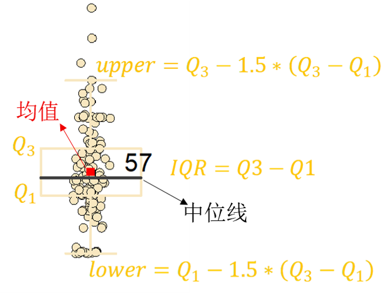
</p>

- **箱型图只是对数据的初步感知，还需结合非参数统计分析系统评估各参数的组间差异显著性与等级相关性**。这里选用 _Kruskal-Wallis_ 检验（_用于判断各参数在不同岩爆等级下的分布**是否存在显著差异**，其零假设是假设各等级分布相同；选用该方法的原因是，各**参数分布多呈非正态**，而该检验**不依赖正态性假设**，**对异常值稳健**_）和 _Spearman_ 相关性分析（_用于量化参数与岩爆等级的单调相关程度，选用该方法的原因是，**岩爆等级是定序变量，且各参数多呈非正态性**，而该方法基于秩次计算，**对非线性单调关系敏感**，且**不受离群点影响**；由于**数据多呈偏态**，_Spearman_ 比 _Pearson_ 更稳健_）。

### 数据分析结果
- 饼状图直观地揭示了**岩爆数据集的类别分布情况**。可以看出，样本存在**轻微的不平衡现象**，其中，中等岩爆样本占比最高（_36%_），约为占比最低的无岩爆类别（_18.3%_）的两倍。这种量级差异处于**温和区间**，无需通过过采样技术强制平衡数据分布。但考虑到地下工程中**强岩爆发生所带来的巨大损失**，且样本中强岩爆事件占比（_18.5%_）不高，为防止模型因样本不足忽略高风险事件，在后续训练中应更**赋予强岩爆类别较大的权重**。

<p style="text-align: center;">
  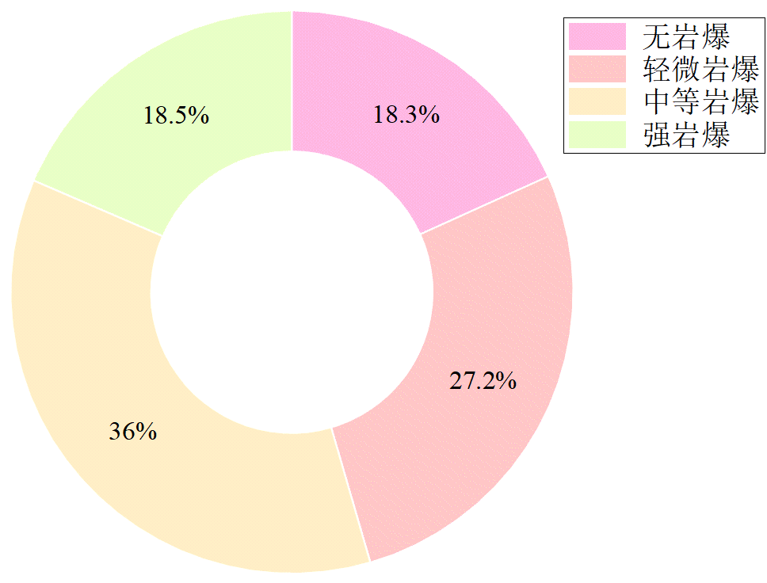
</p>

- 不同岩爆烈度等级的各力学参数统计分析（均值、标准差、方差、偏度、峰度、变异系数、最小值、中位数、最大值、_IQR_）。
1. **_σθ_ 呈现显著的等级依赖性**，0 级岩爆均值为 24.04，1 级升至 47.95（_增幅 99.5%_），2 级达 60.16（_较 1 级增长 25.5%_），3 级急剧上升至 119.96（_较 2 级增长 99.4%_）。该参数在 3 级岩爆时出现数量级跃迁，表明**高应力状态是强岩爆发生的必要条件**。值得注意的是，3 级岩爆的 _σθ_ 最大值已接近 2 级最大值的2倍，印证了**应力累积的非线性特征**。
2. **强度参数（_σc、σt_） 变化平缓**。_σc_ 均值从 0 级的 111.75 增至 3 级的 145.69（_增幅 30.4%_），而 _σt_ 均值从 6.13 增至 11.56（_增幅 88.6%_）。_σt_ 的增长速率显著高于 _σc_，导致 _B1_ 比值在 3 级下降，这一现象与高应力环境下岩石拉伸强度劣化加速的力学机制相符。
3. **_Wet_ 与岩爆等级之间表现出显著的单调递增趋势**，其均值由 0 级的 3.07（_中位数 2.22_）逐步升高至 3 级的 8.40（_中位数 6.815_），各级间增幅依次为 27.6%（_3.07 → 3.92_）、45.1%（_3.92 → 5.69_）、47.6%（_5.69 → 8.40_）。另外，在所有岩爆等级中，**_Wet_ 的中位数始终低于其均值**，这说明该参数数据分布呈右偏态，即**存在部分高 _Wet_ 值的极端样本拉高整体平均水平**。此外，变异系数在各等级间保持较高水平（_CV ≈ 0.65_），这说明随着岩爆等级提升，岩体能量存储能力的空间异质性并未减弱，反而在高应力环境下因岩性非均质性和结构缺陷的差异而进一步凸显。从岩爆机理角度分析，_Wet_ 参数的递增规律与岩爆的能量积聚-突发释放机制高度吻合，**在深部高应力环境下，岩体首先经历弹性变形阶段，将外部载荷转化为弹性应变能储存于岩体内部（_能量积聚阶段_）；当应力集中程度达到岩体强度极限时，储存的弹性能量在极短时间内以动能形式释放，导致岩体突然破裂并伴随弹射、冲击等现象（_突发释放阶段_）**。_Wet_ 作为弹性应变能与塑性耗散能的比值，其数值增大直接反映了岩体从"塑性耗散主导"向"弹性储能主 导"的转变过程：0 级岩爆时 _Wet_=3.07，表明岩体仍具备较强的塑性变形能力，能量主要通过塑性流动耗散；而 3 级岩爆时 _Wet_=8.40，说明岩体储能能力显著增强，塑性耗散能力相对减弱，一旦应力超限，大量储存的弹性能量将瞬间释放，引发剧烈岩爆。因此，***Wet*是岩爆风险评估的核心参数之一，其数值大小直接决定了岩体破坏时能量释放的剧烈程度**。
4. **_SCF_ 在 3 级岩爆中出现临界突变**。0-2 级 _SCF_ 均值维持在 0.26-0.46 区间，而 3 级跃升至1.06，突破临界阈值 1.0。其偏度（_2.05_）和峰度（_3.41_）的大幅升高，表明 **3 级岩爆的应力状态呈现高度右偏分布，存在大量 _σθ>>σc_ 的极端案例**。_SCF_ 的四分位距从 0 级的 0.15 扩大至 3 级的 0.35，反映**强岩爆条件下应力-强度比值的不稳定性增强**。
5. _B1_ 与 _B2_ 在不同岩爆等级下呈现出的变化趋势不同，_B1_ 在 0-2 级岩爆中维持相对稳定的高位区间（_均值20.13-23.15_），然而在 3 级强岩爆条件下出现突然的衰减，均值骤降至 13.87，降幅达 39.9%；而 _B2_ 在 0-3 级岩爆全过程中始终保持高度稳定（_0.84-0.89_），3 级时仅微降至 0.846，变化幅度不足 6%。_B2_ 在强岩爆条件下的显著降低可以归因于高应力环境下岩体内部微裂纹的大量萌生与扩展，随着围岩应力接近或超过岩体强度阈值，微裂纹网络的形成导致有效承载面积减小，抗压强度（_σc_）的下降幅度显著大于抗拉强度（_σt_），从而使 _B1_ 呈现非线性衰减。相比之下，_B2_ 作为归一化脆性指数，通过标准化处理有效规避了岩体绝对强度参数波动的干扰，将脆性特征映射至统一的数值区间，更准确地反映了岩体的本征脆性特征，其数值稳定性表明即使在强岩爆条件下岩体的脆性本质并未发生根本改变，仅是应力状态与能量积聚程度达到了临界阈值。上述变化特征揭示了 _B2_ 较 _B1_ 具有更优的岩爆倾向性表征能力，在**岩爆风险评估实践中应优先采用 _B2_**。

<p style="text-align: center;">
  
</p>

- 箱型图揭示了各力学参数下不同岩爆等级数据的分布特征。

<p style="text-align: center;">
  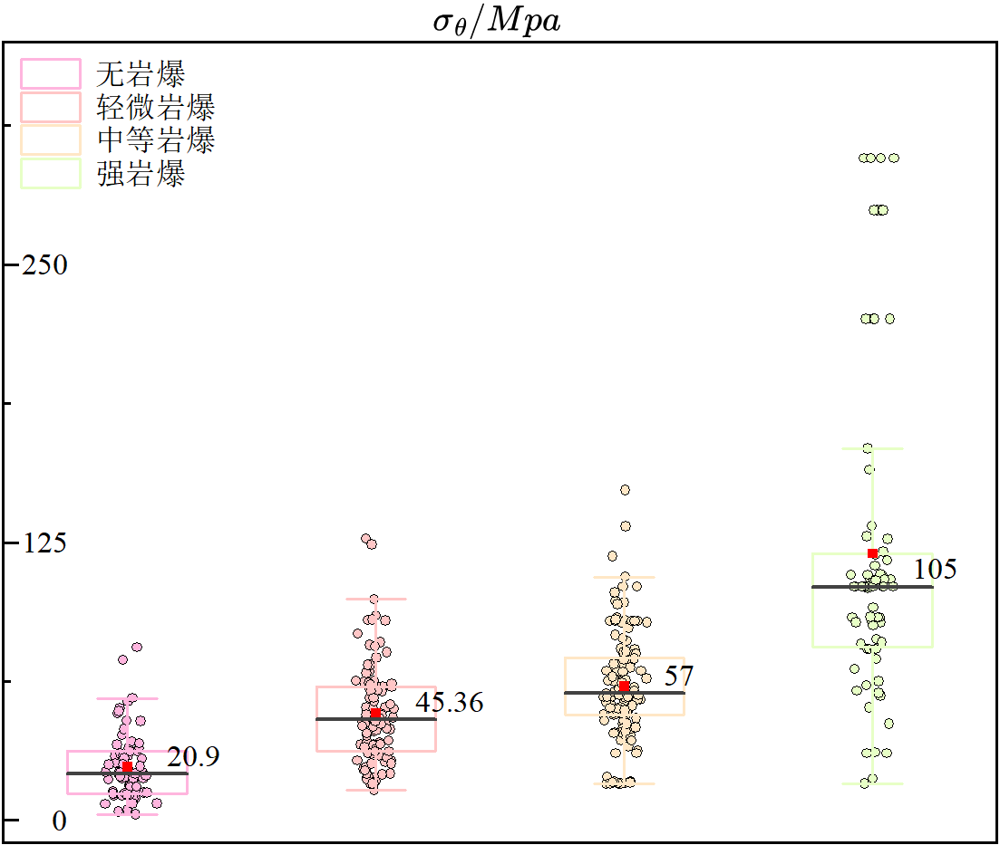
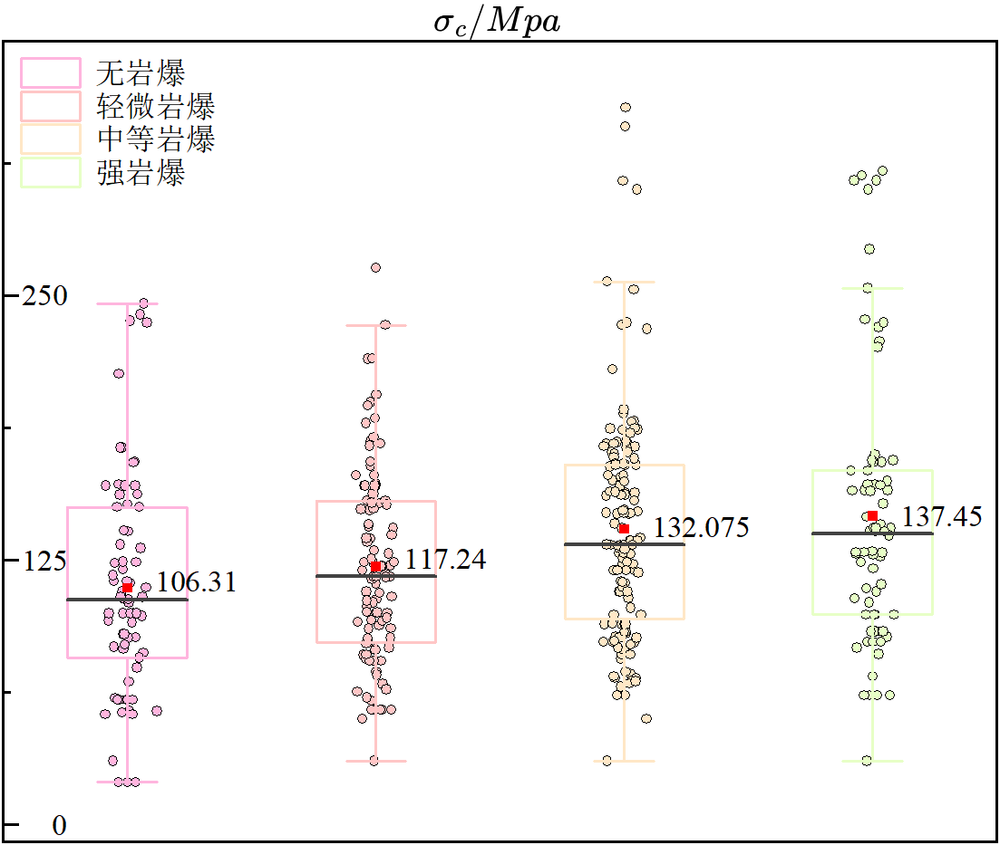
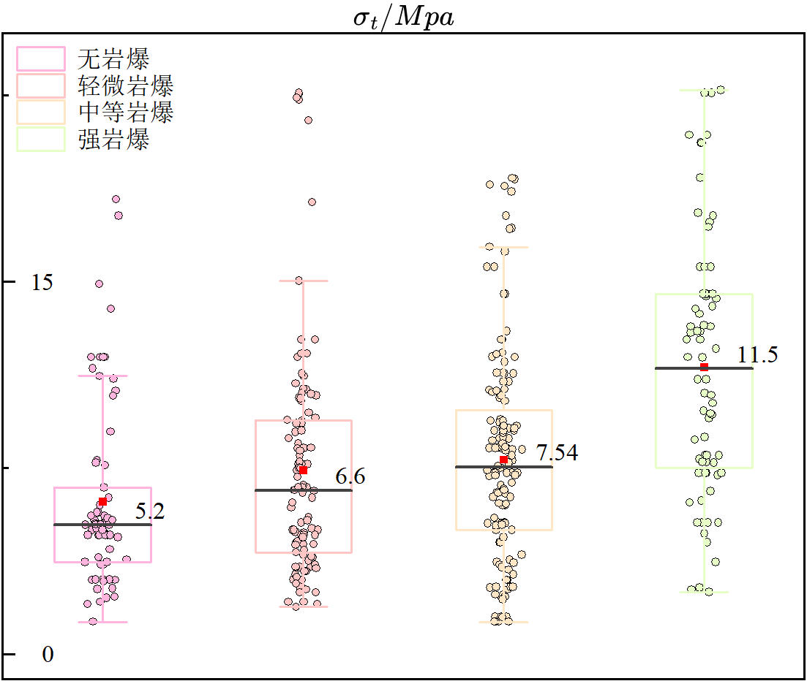
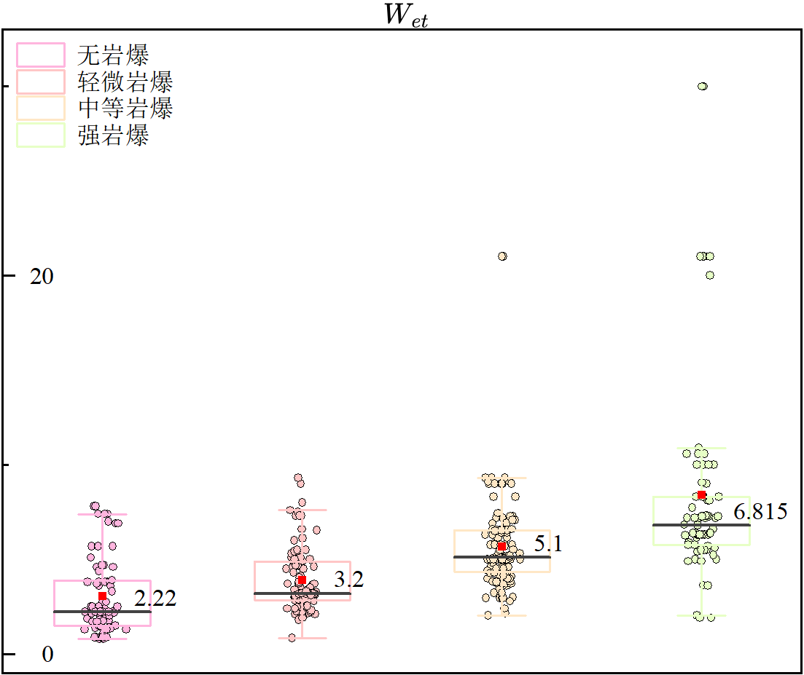
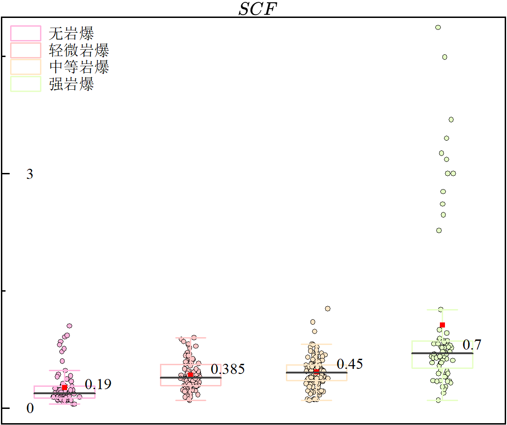
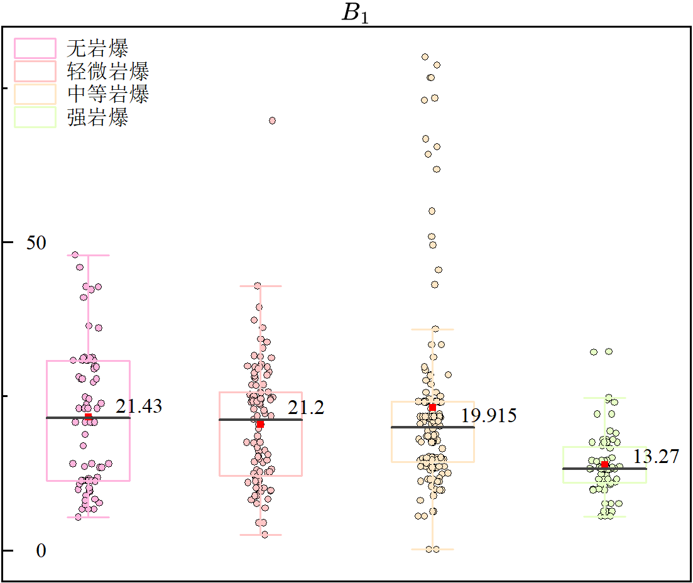
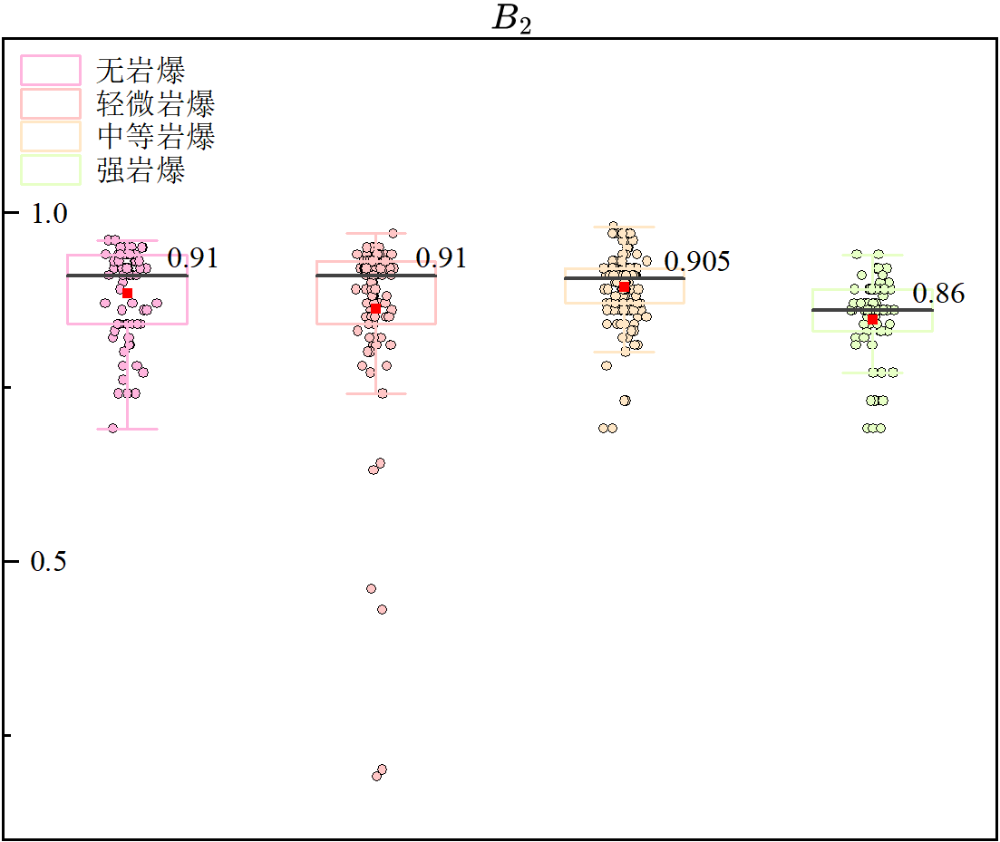
</p>

1. _σθ_ 的强岩爆组与其余等级、无岩爆组与中等岩爆组箱体基本无重叠，但轻微与中等岩爆组存在一定重叠；_Wet_ 的无岩爆与中等岩爆和强岩爆、轻微与强岩爆箱体无重叠，但相邻等级（无和轻微、轻微和中等、中等和强）间重叠近一半；_SCF_ 的无岩爆组与其他等级、中等与强岩爆组箱体分离清晰，但轻微与中等岩爆组重叠严重；_σc_ 与 _σt_ 在各等级间重叠均有较多重叠，单变量区分能力有限，需要进一步挖掘与岩爆烈度的联系；_B1_ 和 _B2_ 的各等级箱体间均存在明显的重叠，尤其是前三个等级间，区分效能微弱。
2. 箱体高度（_IQR_）变化进一步揭示了参数离散程度的演化特征。3 级岩爆的 _σθ_（_IQR=42.01_）和 _Wet_（_IQR=2.55_）箱体高度分别是 0 级的 2.23 倍和 1.06 倍，说明强岩爆案例中力学参数的变异性显著增强。值得注意的是，B1 在 2 级出现异常高离散（_IQR=9.75，为0级的50%_），对应峰度 4.39，表明中等岩爆存在两类极端岩性，高脆性完整岩体与低脆性破碎岩体。_SCF_ 在轻微至中等岩爆组的 _IQR_ 有所收窄，而 *B2* 在轻微岩爆组表现出明显的下须异常值。
3. _σθ_ 与 _SCF_ 在强岩爆组中均出现密集的高位离群点，上须显著延长，反映高应力集中下的长尾风险；_Wet_ 在强岩爆组离群点增多且偏高，中等岩爆组则偶见低位离群点，暗示能量积聚能力的非均匀性；_B1_ 在中等岩爆组同时存在高位与低位离群点，表明该等级岩体脆性差异显著；_B2_ 在轻微岩爆组出现若干低位离群点。整体而言，强岩爆样本普遍呈现右偏分布与高位离群密集特征，而中低等级离群点较少且分布分散。

综合统计分布与箱型图分析，**_σθ_、_Wet_、_SCF_ 对岩爆等级具有较好的单变量区分能力，可作为机器学习模型的核心输入特征**。其中 _σθ_ 对强岩爆识别效果突出，_Wet_ 与 _SCF_ 在无岩爆与中等岩爆和强岩爆间区分明显，但三者对轻微与中等岩爆的区分均存在局限。

- _Kruskal-Wallis_ 检验与 _Spearman_ 相关性分析能够将箱型图的定性观察转化为定量证据，明确**各参数在岩爆等级判别中的统计显著性与相关强度，从而为机器学习建模提供特征筛选依据与理论支撑**。箱型图虽能直观展示参数分布形态与组间差异趋势，但无法得知单参数对不同岩爆等级的具体判别能力，以及相关性强度。而 _K-W_ 检验通过 p 值量化组间分布差异的显著性，事后检验的两两比较通过平均秩次差和 Z 统计量可以有效量化单参数的判别能力大小；_Spearman_ 分析则通过相关系数量化参数与等级、参数与参数之间的相关强度与方向。二者可以**验证箱型图观察到的趋势**，**指导后续机器学习模型的特征选择和模型解释**。
1. **_Kruskal-Wallis_ 检验**：主检验表（_α 取 0.05，p<0.05 则显著_）中卡方用于衡量 4 个岩爆等级间秩次分布的差异大小，值越大说明差异越显著，结果显示**所有参数在不同岩爆等级间均存在显著差异，其中 *σθ*、_Wet_、*SCF* 的判别能力远超其他参数**，这与箱型图分析得出的结论一致；

<p style="text-align: center;">
  
</p>

事后检验结果揭示了各参数在岩爆等级判别中的有效程度（_主检验将族系错误率控制在 α=0.05 的水平，即我们设定了最多 5% 的容忍度来拒绝‘四组分布相同’的原假设。而在事后两两比较中，为了避免多重比较导致的假阳性累积，我们采用了 Bonferroni 校正。这使得每一组两两比较的实际显著性阈值远低于 0.05，从而使被判定为显著的差异具有更高的可靠性。_）。事后检验表中，平均秩次差的绝对值越大说明比较的两个等级在这个参数上分得越开，该参数对这两个等级的判别能力越强，而 Z 统计量的绝对值大小则是这种判别能力强弱的可信度；“是否显著”一列为 1 则表示比较的两个组间差异显著。
**_σθ_ 展现出最为全面的判别能力，可以作为岩爆等级判别的核心特征**，在所有 6 对等级比较中均表现出统计学显著性，特别是在无岩爆（0 级）和轻微岩爆（1 级）、轻微岩爆和中等岩爆（2 级），这两组等级仅在 *σθ* 和 *Wet* 上差异显著。**_Wet_ 在 6 对比较中表现出 5 对显著性**，仅在 0-1 的比较中未达到显著性水平。**_SCF_ 同样在 5 对比较中显著**，但在 1-2 间差异不显著。**_σt_ 仅在 4 对比较中显著**，特别是在 1-2 组间完全无差异（_p=1_）。**_B1_ 和 _B2_ 在相同的 3 对比较中显著**，且均是强岩爆（_3 级_）与其他等级的对比，而在其他等级之间的比较中均未表现出显著差异。

<p style="text-align: center;">
  
</p>

由事后检验可得**单参数判别能力排序**，表中红色表示该参数在等级比较中差异显著。结果表明，***σθ* 展现出最优的整体判别效能**，其在所有组别对比中的平均秩次差绝对值均位列前茅，且差异均达到统计学显著水平，这说明该参数能有效区分岩爆发生的不同阶段；**_SCF_ 同样表现出较强的判别能力**；值得注意的是，**_Wet_ 与脆性系数（_B1、B2_）表现出明显的互补特征**，_Wet_ 在 2-3 组间区分上效能不足，但其他组间排名靠前；相反，脆性指数（_尤其是 B2_）在 2-3 组间判别能力靠前，能有效识别中、强岩爆的临界状态，但在区分低烈度岩爆时效果不佳（_弹性应变能指数 _Wet_ 表征岩石储能能力，主导了岩爆“从无到有”的质变，但在高能级区间 2-3 因样本普遍具备高储能特征而区分度下降；脆性指数 _B2_ 表征岩石“耐压不耐拉”的极端程度，决定了能量释放的猛烈程度，即“爆得烈不烈”，因此在区分中、强烈度岩爆即 2-3 时表现出较好的判别力，而在低烈度岩爆则相对迟钝_）。此外，相邻等级之间的参数判别效能低于非相邻等级（_尤其是 0-1、1-2_），这表明岩爆的孕育与发生并非离散的阶跃过程，而是一个能量积累与损伤演化的连续渐进过程，在从轻微向中等过渡的临界模糊区间，单一宏观力学参数难以捕捉这种量变积累的细微差异，且该阶段破坏模式更易受局部地质构造或随机结构面等非均质性因素控制，导致样本分布界限模糊。

<p style="text-align: center;">
  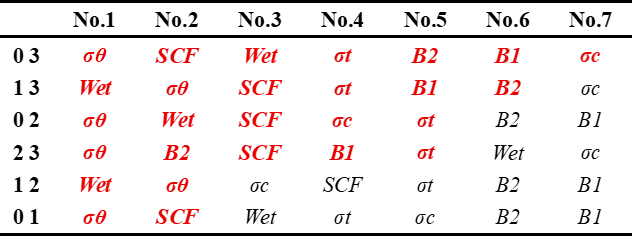
</p>

2. **_Spearman_ 相关性分析**：相关性分析结果显示，**所有力学参数与岩爆等级（_MR_）均呈显著相关（_p < 0.0001_）**，这与主检验结果一致。其中，**_σθ_、_Wet_ 和 _SCF_ 与 *MR* 呈正相关，_σc_ 和 _σt_ 与 _MR_ 呈弱正相关，*B1* 和 *B2* 与 _MR_ 呈弱负相关**。值得注意的是，**_B1_ 与 _B2_ 高度相关，为避免多重共线性问题，若选用为特征应仅考虑一个**。

<p style="text-align: center;">
  
</p>

# 数据建模

## 1.特征选择
经数据分析可知，7 个力学参数中，**_σθ_、_Wet_、_SCF_ 与岩爆烈度等级相关性最强，且 _σθ_ 与 _SCF_ 在所有等级间均展现出稳定的判别能力**；_σt_、_σc_、_B1_、_B2_ 相关性次之，其中 **_Wet_ 与脆性指数（_尤其是 _B2__）呈现互补的判别特征**，**_σt_、*σc*单变量区分能力有限，但可能在与其他参数组合时具有价值**。需要注意的是，**_B1_ 与 _B2_ 高度共线（_ρ=0.974_），为避免模型不稳定，二者不能同时输入**。尽管单变量分析揭示了各参数与岩爆烈度的独立关联，但**参数间的组合效应及对判别性能的协同影响还不明确**，同时，考虑到穷举式地尝试所有可能的特征组合以寻找最优子集的方法不仅计算效率低下，而且在实际应用中缺乏可扩展性（_一旦数据规模扩大或特征维度增加，组合数量会呈指数级增长，计算成本急剧上升，使得**穷举的方法不可行**_）。因此，**结合岩爆机理和各参数的物理含义，以及统计特性构建了具有明确工程解释性的 14 组特征组合方案**。

<p style="text-align: center;">
  
</p>

考虑到岩爆预测需要全面反映应力状态、岩体强度特性和能量积聚能力，构建了包含最大切应力(_σθ_)、单轴抗压强度(_σc_)、单轴抗拉强度(_σt_)和弹性性能指数(_Wet_)的**无冗余组合 F-1[_σθ_,_σc_,_σt_,_Wet_]，该组合涵盖了完整的力学信息且不存在数学冗余**。其次，鉴于**比值参数在岩土工程中的重要物理意义，分别构建了 F-2[_SCF_,_Wet_,_B1_]和 F-3[_SCF_,_Wet_,_B2_]两个比值形式组合**，其中 *SCF*（_σθ/σc_）表征应力集中程度，_B1_（_σc/σt_）和 *B2*（_(_σc-σt_)/(_σc+σt_)_）分别表征岩体脆性特征，由于 *B1* 与 *B2* 高度相关(_ρ=0.974_)但各自具有不同的物理内涵，故分别进行实验以确定最合适的脆性指数。另外，**基于 _Spearman_ 相关性分析结果，_σθ_、_Wet_、*SCF* 与岩爆等级的相关性最强(_ρ=0.668、0.603、0.516_)，且 _K-W_ 检验中主检验结果显示显著性水平远超其他参数，因此构建 F-4[_SCF_,_Wet_,_σθ_]组合**。然而，该组合缺失了抗拉强度(_σt_)信息，而 _σt_ 对于完整描述岩体强度特性至关重要，因此在此基础上分别添加 _B1_、_B2_ 和 _σt_，**形成 F-5[_SCF_,_Wet_,_σθ_,_B1_]、F-6[_SCF_,_Wet_,_σθ_,_B2_]和 F-7[_SCF_,_Wet_,_σθ_,_σt_]三个扩展组合，以验证不同方式补充 _σt_ 相关信息的效果**。此外，还构建包含全部参数的特征组合 **F-8[_σθ_,_σc_,_σt_,_Wet_,_SCF_,_B1_,_B2_]**，该组合可以作为判断**参数精简有效性的参照基准**，同时考虑到**共线参数（_B1、B2，ρ=0.974_）** 对预测性能的不利影响，又分别构建了 **F-9[_σθ_,_σc_,_σt_,_Wet_,_SCF_,_B1_]** 和 **F-10[_σθ_,_σc_,_σt_,_Wet_,_SCF_,_B2_]**。为**尽可能地减少参数冗余的影响**，针对单变量分析中揭示的 **_σθ_ 与 _SCF_ 强相关性（_ρ=0.728_）、_σt_ 与 _B1_ 强相关性（_ρ=-0.690_）**，**以及 σc 与 SCF、B1 的数学依赖关系**（_SCF=σθ/σc、B1=σc/σt，这里没有 B2 的相似组合，是因为 B1 与岩爆等级的相关性略强于 B2，且物理意义更直观，同时，两种脆性指数的判别效果已有3组对比可以得到，不需要再构建更多组合_），又进一步构建了 **F-11[_Wet_,_σθ_,_B1_]**、**F-12[_σθ_,_σc_,_σt_,_Wet_,_SCF_]**、**F-13[_σθ_,_σt_,_Wet_,_SCF_,_B1_]**、**F-14[_σθ_,_σt_,_Wet_,_B1_]**。
## 2.评价指标
针对**岩爆数据存在的轻微类别不平衡问题**，若采用常规准确率（_accuracy_）等指标进行评估，将导致模型性能评价偏向样本量较多的岩爆等级，而忽略对高风险但占比不高的强岩爆事件的识别能力，从而无法真实反映模型在各类岩爆烈度等级上的综合预测性能。因此，为全面、客观地评估模型性能，采用**平衡准确率（_balanced_accuracy_）、宏平均F1（_f1_macro_）、加权F1（_f1_weighted_）、微平均F1（_f1_micro_）、负对数损失（_log_loss_）和加权ROC-AUC（_roc_auc_）作为评价指标**。

<p style="text-align: center;">
  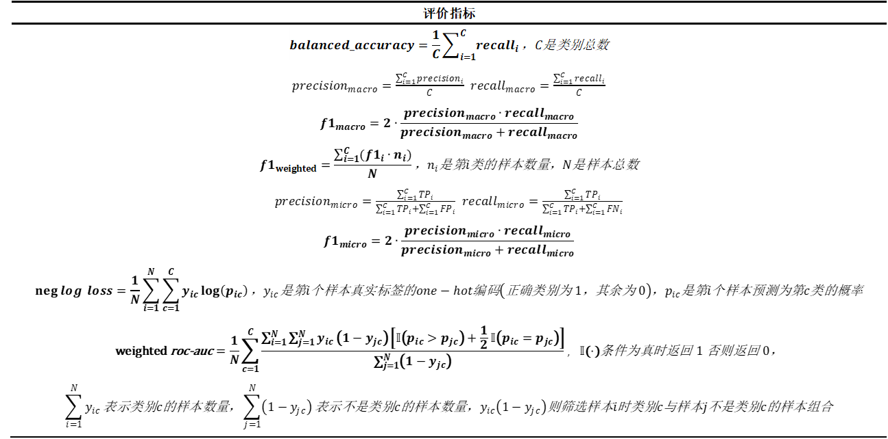
</p>

其中，**balanced_accuracy** 通过计算各岩爆等级召回率（_Recall_）的算术平均值，消除类别分布偏差，在不平衡数据中实现对常规准确率的公平替代，确保各岩爆等级获得平等评估权重。**f1_macro** 通过对各岩爆等级 f1 值进行简单算术平均，每个类别贡献相同权重，特别适用于评估模型对少数类别的识别能力；**f1_weighted** 则根据各类别样本数量进行加权平均，反映模型在实际数据分布下的综合性能；**f1_micro** 通过汇总所有类别的真正例（_TP_）、假正例（_FP_）和假负例（_FN_）后计算全局 f1 值，等价于整体准确率，从样本总量角度评估模型的整体判别性能。**负对数损失log_loss** 绝对值越小，代表模型的概率越准确（_对 *K* 分类问题，随机盲选理论值为 *-ln(1/K)*，对四分类问题该值约为-1.386_）。**加权 roc_auc** 可作为评估多分类模型判别能力的补充指标，其采用 one-vs-rest 策略，对每个岩爆等级分别计算其作为正类、其余等级作为负类时的 ROC 曲线下面积，然后按各类别样本比例进行加权平均，值越接近于 1 表明模型对各类岩爆事件的区分能力越强，越接近 0.5 则说明模型的预测接近随机猜测。
## 3.机器学习模型
鉴于**岩爆机理的复杂性和高度非线性特征**，以及使用的**岩爆数据样本有限（_仅 389 条_），且存在轻微的类别不平衡和异常值影响**，项目选择对小样本学习、非线性拟合、异常值鲁棒，以及对类别不平衡具有良好适应性的**支持向量机（_SVM_）**、**随机森林（_RF_）**、**自适应增强（_AdaBoost_）**、**极限树（_ET_）**作为候选模型，同时考虑**决策树（_DT_）**、**_K_ 近邻（_KNN_）** 和 **多层感知机（_MLP_）** 作为性能基线（_当这些简单算法与前述复杂算法性能相当时，优先选用简单算法_）。
项目采用 **auto-sklearn 自动化机器学习框架**进行模型构建与优化。该框架能够**端到端地自动执行数据预处理策略选择、特征选择、模型算法选择及超参数搜索的完整工作流**（_具体实现详见 ./src/model/auto_classifier.py_）。需要指出的是，auto-sklearn 的优化过程具有计算预算依赖性，且未采用确定性的超参数搜索策略；因此，**在不同训练时长约束或重复运行下，所得的最优模型配置存在随机性差异**。实验训练得到的模型配置和权重已存放至 _./static/models_ 目录。
## 4.特征组合与机器学习模型性能分析
此次项目**采用平衡准确率（_balanced_accuracy_）作为核心评价指标**，系统评估了 **14 组特征组合方案与 7 种机器学习模型**的协同预测性能。实验结果表明，**特征组合 F-14[_σθ, σt, Wet, B1_]与 _AdaBoost_ 模型的方案展现出最优的预测性能，平衡准确率达 0.885**。虽然 F-13（_[σθ, σt, Wet, SCF, B1]，0.830_） 在全部 7 种算法上的平均平衡准确率略优于 F-14（_0.823_），但两者性能差异不足 1%，且在 _AdaBoost_ 模型上均取得了最好性能。因此，**在性能差异微小的情况下选择参数更少的 F-14 作为最终的输入特征**。

<p style="text-align: center;">
  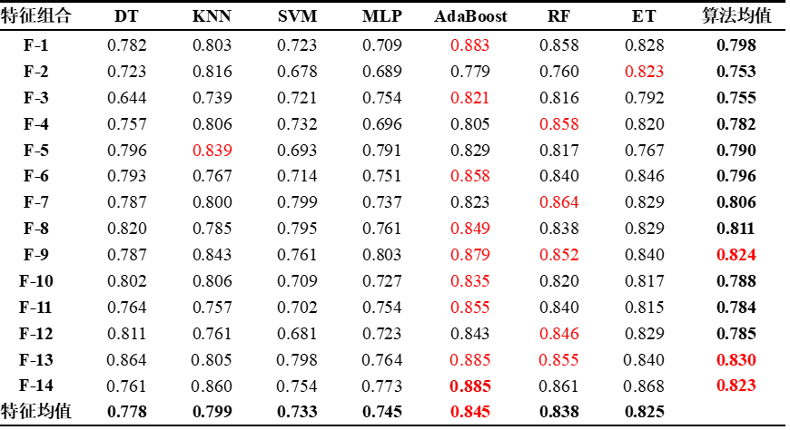
</p>

对比各特征组合的平均平衡准确率可以发现，仅包含比值参数的 F-2（_[Wet, SCF, B1]，0.753_）和 F-3（_[Wet, SCF, B2]，0.755_）在所有方案中表现最差，这表明**脱离了绝对力学基准的纯比值体系会丢失岩体真实的绝对应力水平与强度大小信息**，从而导致模型性能下降。相反，在基础组合 F-1（_[σθ, σc, σt, Wet]，0.798_）的框架上合理融入比值参数能够提升预测性能，F-7（_[σθ, Wet, SCF, σt]，0.806_）、全参数 F-8（_[σθ, σc, σt, Wet, SCF, B1, B2]，0.811_）以及 F-9（_[σθ, σc, σt, Wet, SCF, B1]，0.824_）均优于 F-1，这说明**比值参数能够有效放大岩爆孕育过程中的非线性力学响应特征，与基础参数形成优势互补**。

多组对照实验确立了**脆性指数 _B1_（_σc/σt_）作为核心特征的不可替代性**。无脆性指数的 F-4（_[σθ, Wet, SCF]，0.782_）和 F-12（_[σθ, σc, σt, Wet, SCF]，0.785_）性能均低于引入脆性指数的 F-5（_0.790_）、F-6（_0.796_）、F-9（_0.824_）和 F-10（_[σθ, σc, σt, Wet, SCF, B2]，0.788_），证实了**脆性指数的加入普遍带来了性能增益**。在 _B1_ 与 _B2_ 的横向对比中，F-2 与 F-3、F-5 与 F-6 的性能差异微小，但在复杂组合中 F-9（_0.824_）优于 F-10（_0.788_）。针对高度共线参数（_ρ=0.974_）的冗余验证显示，**同时引入 _B1_ 和 _B2_ 的 F-8（_0.811_）并未出现严重的性能下降**；另外，F-9（_仅含 B1_）的性能优于 F-8、F-10，鉴于 _B1_ 物理含义更直观且判别效能更优，认为 **_B1_ 是此次岩爆预测不可或缺的参数之一**。

**在单轴抗拉强度（_σt_）的表征形式上，直接引入原始参数优于间接表征**。F-4（_不含 σt 信息，0.782_）与 F-5（_通过 B1 间接包含，0.790_）、F-6（_通过 B2 间接包含，0.796_）以及 F-7（_直接添加 σt，0.806_）的对比结果表明，**补充 _σt_ 信息对完善岩体强度特征描述至关重要**。F-7 的性能优于 F-5 和 F-6，表明在模型特征空间中**直接保留 _σt_ 的原始数值分布比将其压缩至脆性指数的比值空间中，更能保留对岩爆判别有利的细粒度信息**。

关于最大切应力（_σθ_）与应力集中系数（_SCF_）的效能差异，实验数据高度印证了前期单变量相关性分析的结论。F-2（_含 SCF 无 σθ，0.753_）、F-5（_同含 σθ 与 SCF，0.790_）和 F-11（_[Wet, σθ, B1]，含 σθ 无 SCF，0.784_）的结果显示，**_σθ_ 和 _SCF_ 的引入均能提升模型性能，但添加 σθ 带来的性能增益更明显**。这证实了 _σθ_ 作为直接反映岩体应力状态的绝对物理量，与岩爆烈度等级的内在关联性更强。在**特征维度受限或需控制参数冗余的场景下，优先保留 _σθ_** 是更为科学的特征选择策略。

**单轴抗压强度（_σc_）在特定特征体系下表现出明显的冗余干扰**效应。F-12（_[σθ, σc, σt, Wet, SCF]，0.785_）与 F-13（_[σθ, σt, Wet, SCF, B1]，0.830_）的对比表明，在含 _SCF_ 的体系中，**用 _B1_ 替代 _σc_ 能够一定程度上提高预测性能**，证实了 **_σc_ 与 _SCF_（_σθ/σc_）、_B1_（_σc/σt_）之间存在的依赖关系会使直接引入 *σc* 反而干扰模型的特征提取**。进一步对比 F-13（_0.830_）与 F-14（_[σθ, σt, Wet, B1]，0.823_）发现，剔除 _SCF_ 后平均平衡准确率仅略微下降，且两者在 _AdaBoost_ 上均取得 0.885 的最高平衡准确率。这说明**当体系中已包含 _σθ_ 和 _B1_ 时，_SCF_ 提供的应力集中信息被充分涵盖，其存在不再产生明显增量价值**。因此，认为**包含全部关键信息且较为精简的 F-14 是最优的输入特征组合**。

<p style="text-align: center;">
  
</p>

从实验结果可明显看出**集成学习方法（_AdaBoost、RF、ET_）的整体表现优于简单机器学习方法（_DT、SVM、MLP、KNN_）**。在 F-14 最佳特征组合下，***AdaBoost* 展现出最优异的综合性能，其 *balanced_accuracy* 达到 0.885，*F1_macro* 为 0.884，*roc_auc* 高达 0.973，且 *neg log_loss* 最小（_-0.460_），表明其分类准确性和置信度均最优**。具体到各类别，*AdaBoost*在无岩爆类别上召回率达 100%，在轻微岩爆类别上精确率（_0.929_）和 F1 值（_0.743_）均领先，强岩爆类别表现也十分稳健。RF和ET作为另外两种集成方法，同样表现出色。_RF_ 在中等岩爆类别的精确率（_0.923_）和 _F1_ 值（_0.889_）上优势明显；_ET_ 在强岩爆类别上精确率达 100%，且整体 _F1_ 指标稳定。相比之下，简单机器学习方法中，_KNN_ 在部分指标上表现尚可（_roc_auc 0.949_），但整体性能仍不及集成方法。值得注意的是，**_DT_ 和 _MLP_ 在强岩爆类别上表现突出，甚至优于集成方法，但在轻微岩爆等类别的识别上存在明显短板，导致整体性能受限**。